# 1day-study

## 표준프레임워크 1DAY 스터디 (1st)

### 일단

만들어볼까요?
먼저, 개발환경 다운로드!!!
https://code.visualstudio.com/download

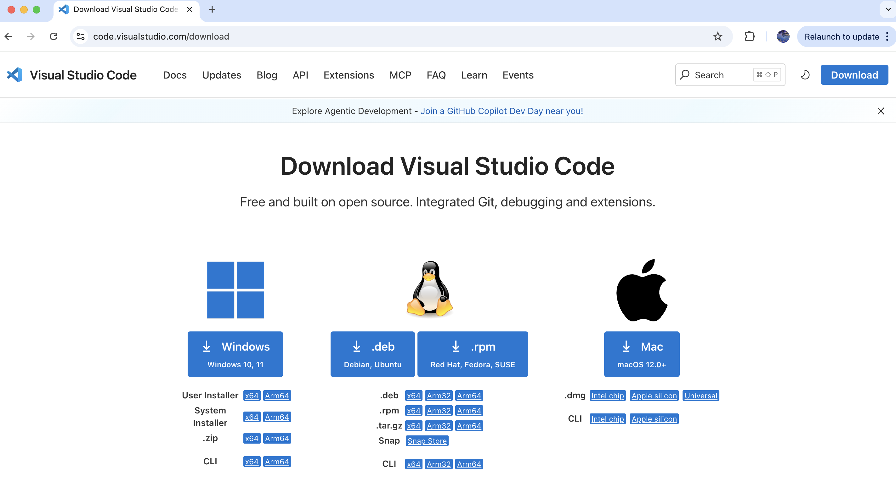

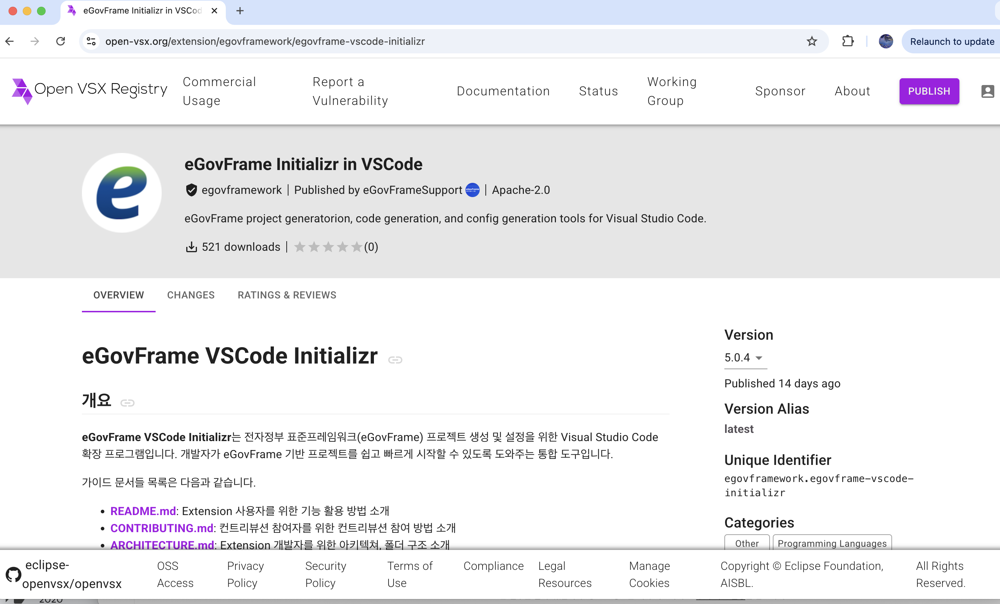

https://open-vsx.org/extension/egovframework/egovframe-vscode-initializr

--- 
### 일단

Demo

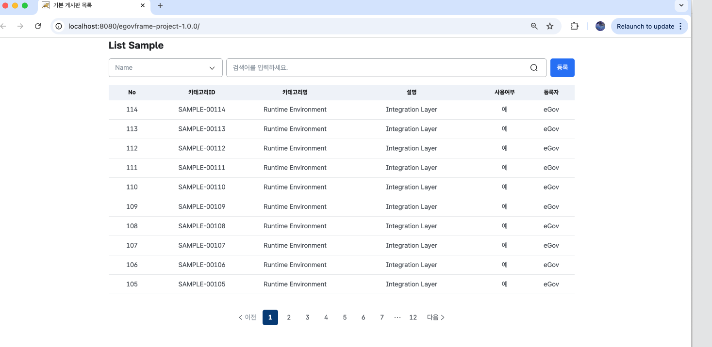

---

### 구조 이해

Controller → Service → DAO

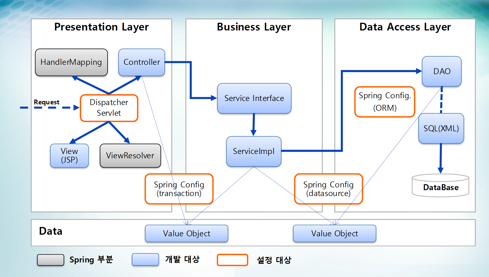

---

### Spring 생태계 한번에 몰아보기

Spring  
SpringSpring Boot Spring AI
Spring Boot 
Spring AI 
구조를 잡아주는 뼈대 - Java 기반 애플리케이션 프레임워크 핵심: IoC / DI, AOP, MVC 엔터프라이즈 구조 표준 제공
Spring 을 쉽게 쓰게 해주는 도구 - Spring 설정을 자동화 내장 서버 (Tomcat 등) 빠른 실행 & 개발 생산성 향상
AI를 Spring 안으로 가져온 것 - LLM(OpenAI, Ollama 등) 연동 지원 
Chat, Embedding, RAG 기능 제공 
기존 Spring 구조 안에 AI 통합 

---

### Spring 핵심개념 

IoC (Inversion of Control)
DI  (Dependency Injection)
AOP (Aspect Oriented Programming)
Configuration

IoC (Inversion of Control)

DI  (Dependency Injection)
AOP (Aspect Oriented Programming)
제어의 역전, 만들지 않고 주입받는다 - 객체 생성/관리를 Spring이 담당 개발자는 사용만
필요한 것은 알아서 넣어준다 – 필요한 객체를 자동으로 주입, @Autowired 
공통 기능을 분리 (로그, 트랜잭션 등) 비즈니스 로직과 분리, 필요시점에 사용할 수 있도록 
Configuration
애플리케이션 설정관리 - Bean 설정 및 환경 정의 @Configuration, application.yml

---

### Spring 

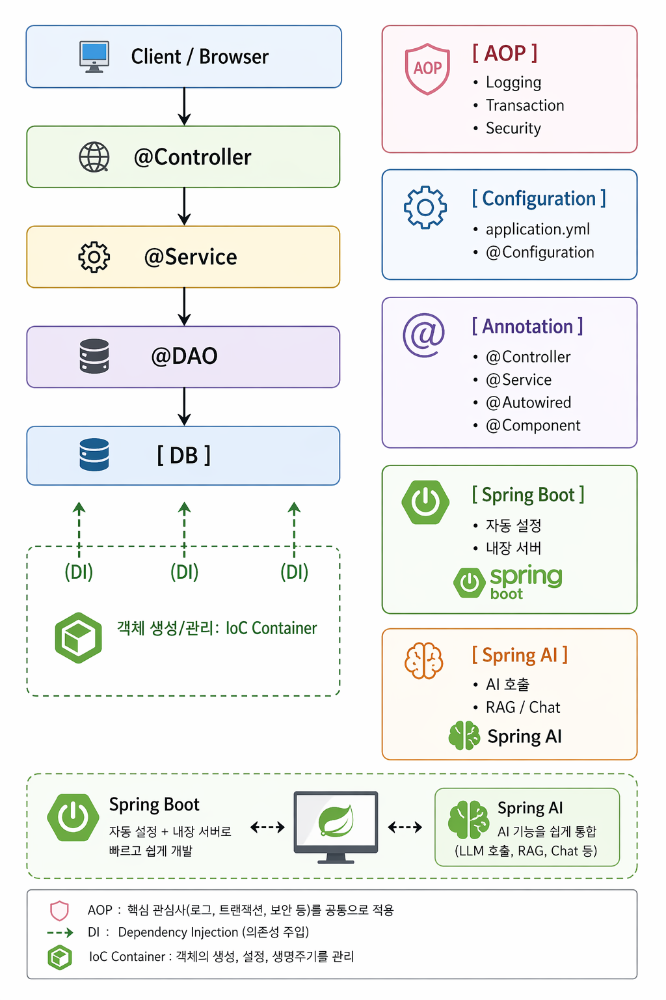

---

### 개념 
AI
AIAI Agent
MCP
…?
LLM (Large Language Model)
ChatGPT / OPENAI 
Claude / Anthropic
Gemini / Google 
Gemma / Gemma는 구글 딥마인드가 개발한 오픈 소스 대형 언어 모델 시리즈
Qwen / 알리바바가 주도하여 개발한 글로벌 수준의 오픈/상용 하이브리드 대형 언어 모델

  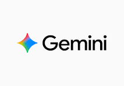 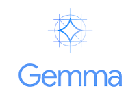 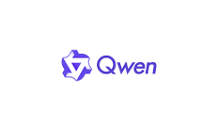 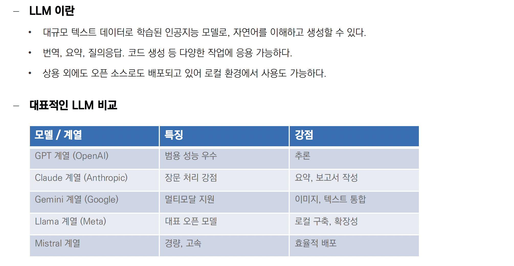

---

### AI 개발도구

Cursor
https://cursor.com/ko/home

Claude Code
https://code.claude.com/docs/ko/quickstart

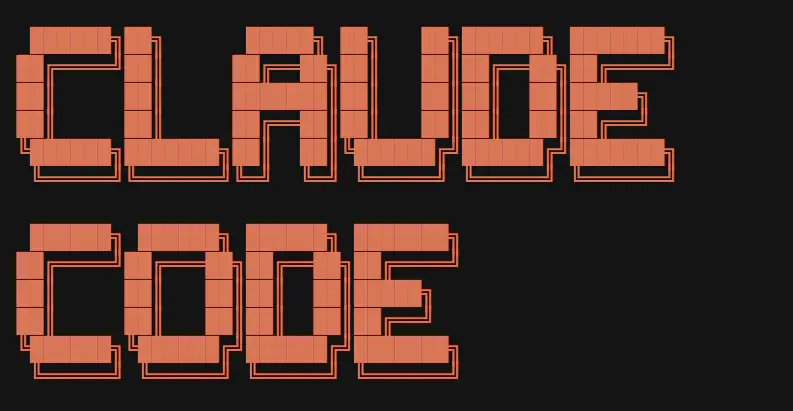{width=100}

Warp
https://www.warp.dev/download

---

### AI 적용/활용
현장에서는 아래의 업무들에 활용하고자 함

표준프레임워크를 이용한 서비스 개발 
전자정부 표준프레임워크를 이용한 웹페이지 구현
표준프레임워크에 대해 이해하고, 오픈소스에 기여 
버전 업 마이그레이션, 3.10 -> 5.0

---

### 표준프레임워크 1DAY 스터디 (2nd)

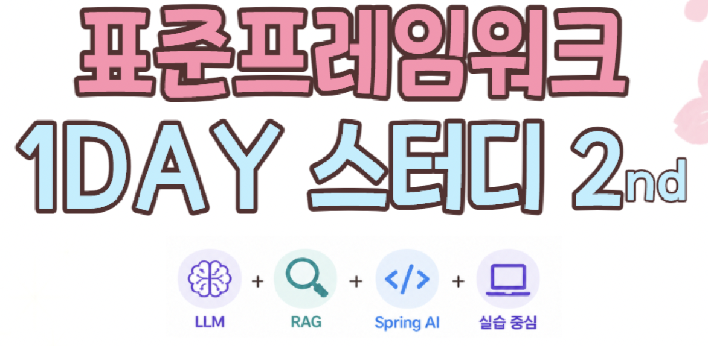

---

## AI 로 개발된 서비스는 

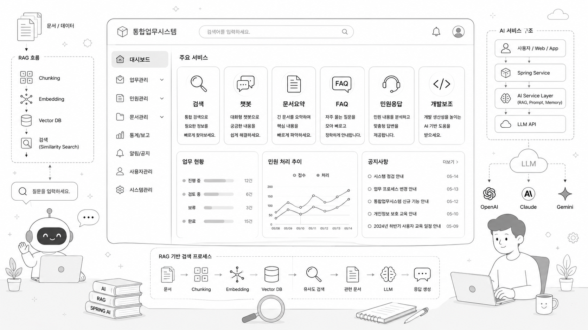

### AI 시대의 개발

검색
Chatbot
문서요약
FAQ
개발보조

---

### AI 서비스 동작

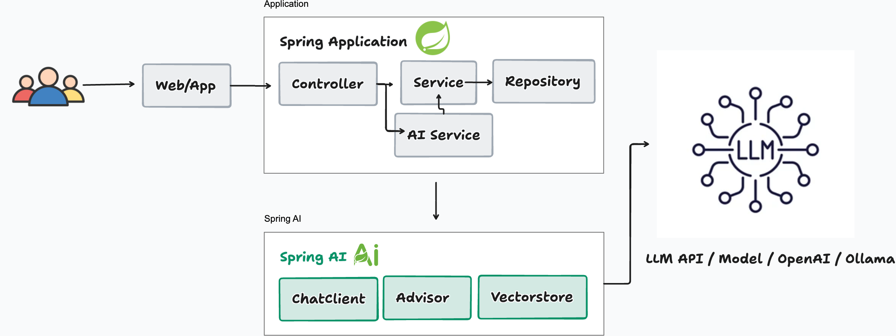

Prompt 관리
RAG
Embedding
AI 정책관리

---
### AI 핵심개념

LLM  
LLM 
Prompt
Prompt Engineering
Prompt & Prompt Engineering
＂가장 확률 높은 다음 단어를 맞추는 문장 완성기”

방대한 텍스트를 학습해 인간처럼 대화하는 AI (GPT, Claude, Gemini)

지시어(Input)를 주면 확률적으로 가장 자연스러운 답변(Output)을 생성.
"AI에게 전달하는 함수의 Parameter”

- Prompt: AI에게 보내는 모든 명령어나 질문(텍스트).
- Engineering: 답변의 품질을 높이기 위해 질문을 구조화하는 기술.
- System Prompt: AI에게 "너는 전문 개발자야"와 같은 페르소나(역할)나 규칙을 부여하는 설정값.

---
### AI 핵심개념

Embedding & Vector
"텍스트를 컴퓨터용 숫자로 변환한 좌표”

Embedding: 문장의 '의미'를 추출해 수천 개의 숫자(Vector) 배열로 바꾸는 과정.

Vector: 의미가 비슷하면 공간상에서 거리가 가깝고, 다르면 멀리 배치됨.

Ex) 사과'와 '포도'는 좌표상에서 붙어 있고, '자동차'는 멀리 떨어져 있음

---
### AI 핵심개념

양자화
(Quantization)  데이터의 다이어트
“정밀도를 조금 양보하고, 성능과 속도를 얻는 기술”
모델의 가중치나 벡터 데이터(보통 32비트 부동소수점, FP32)를 더 작은 단위(예: 4비트, 8비트 정수)로 변환하는 과정
double이나 float 데이터를 int나 byte로 Casting하여 메모리 점유율을 줄이는 것과 유사

양자화 효과 
  - .용량 감소: 모델 크기가 1/4~1/8로 줄어듬 (Ex =30GB 모델 → 5~8GB)
  - .속도 향상: CPU/GPU의 연산 부하가 줄어들어 답변 속도향상 
  - .로컬 실행: 양자화 덕분에 Llama 같은 거대 모델이 일반 노트북(Ollama 등)에서도 실행, 서비스 가능

  - . Trade-off: "양자화가 심해질수록 모델이 정밀도 하락 가능.하지만 최근 기술(GGUF, AWQ 등)은 4비트까지 줄여도 성능 저하가 거의 없음

---

### AI 핵심개념

"키워드가 아닌 '의미'로 검색하는 저장소”- 기존 DB (SQL): WHERE title LIKE '%사과%' (단어가 정확히 일치해야 함).

- Vector DB: "빨간색 달콤한 과일" 검색 → '사과' 좌표와 가장 가까운 데이터를 추출.
역할: RAG에서 질문과 관련된 참고 자료를 빛의 속도로 찾아주는 '지식 창고'.

---
### AI 핵심개념

""오픈북(배운데서) 테스트: 검색으로 지식을 보강한 AI 답변”

- LLM은 최신 정보나 우리 회사 내부 데이터를 모름.

- 질문과 관련된 문서를 우리 DB에서 먼저 찾음 (Retrieval).
- 그 문서를 질문과 합쳐서 AI에게 전달 (Augmentation).
- AI는 그 정보를 바탕으로 정확한 답변을 생성 (Generation).

RAG
(검색 증강 생성, Retrieval-Augmented Generation)

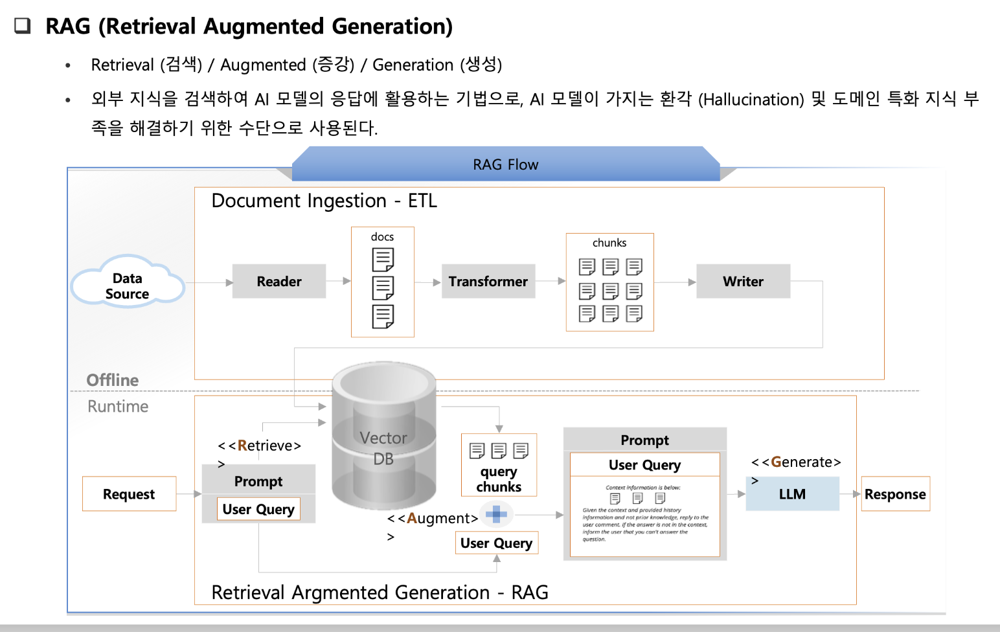

---
### 추가로

"API 하나로 수많은 모델을 골라 쓰는 백엔드 서비스”- AWS Bedrock: 기업용 클라우드 환경에 최적화. 보안과 데이터 독립성이 중요할 때 사용 (Claude, Llama 등 지원). 인프라 통합

- OpenRouter: 여러 서비스(OpenAI, Anthropic, Google 등)를 단일 API 인터페이스로 통합해 주는 Aggregator. 다양한 모델을 테스트할 때 편리함.

- Ollama: 내 노트북에서 모델을 직접 돌리는 'Docker 스타일'의 로컬 실행기.
LLM 서비스 플랫폽
Platform : 클라우드 vs 로컬

---

### 그래서

"AI 기능을 Spring답게 주입하는 표준 인터페이스”- LLM 기능을 Spring 환경에서 쉽게 연동하도록 돕는 추상화 라이브러리.

ChatClient, VectorStore 등 인터페이스 기반 설계로 특정 AI 벤더(OpenAI, Ollama 등)에 종속되지 않는 코드 작성 가능.

- application.yml 설정만으로 모델을 교체하고, POJO 방식으로 AI 답변을 자바 객체로 매핑(Output Parsing)할 수 있음.
Spring AI

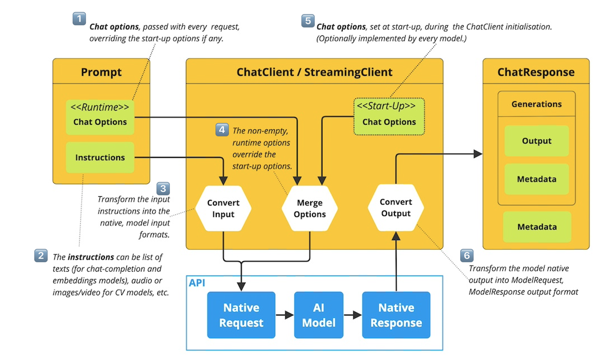
