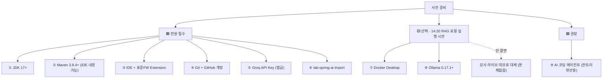

# 🧰 Spring AI 1-Day 워크샵 (3차) · 사전 환경 확인 & 설치 가이드

> **대상**: 참여자 (당일 오기 전 완료)
> **원칙**: 아래 🟥 **필수 6종**은 반드시 미리 끝내오세요. 10:10 환경 세팅 시간이 최대 병목이라, 사전 완료 시 당일엔 스모크 테스트(테스트 1개 실행)만 하면 됩니다.
> **무설치 강조**: 이번 3차는 **Groq 클라우드**로 실습하므로 Docker/Ollama는 **필수 아님**. 오후 RAG(14:20)를 *로컬로 직접* 돌려보고 싶은 분만 🟨 선택 항목을 설치하세요.

---

## 0. 필수 / 선택 한눈에



---

## 1. ⚡ 빠른 자가진단 (먼저 이것부터 실행)

터미널에 아래를 붙여넣어 한 번에 현재 상태를 확인하세요.

**macOS / Linux** (터미널)
```bash
echo "== JDK =="   ; java -version
echo "== Maven ==" ; mvn -version
echo "== Git =="   ; git --version
echo "== Docker(선택) ==" ; docker --version
echo "== Ollama(선택) ==" ; ollama --version
```

**Windows** (PowerShell)
```powershell
"== JDK ==";    java -version
"== Maven =="; mvn -version
"== Git ==";   git --version
"== Docker(선택) =="; docker --version
"== Ollama(선택) =="; ollama --version
```

> `command not found` / `찾을 수 없습니다` 가 나오면 해당 항목을 아래에서 설치하세요.
> 버전이 기준보다 낮으면(예: JDK 11, Ollama 0.16.0) **업그레이드**가 필요합니다.

---

## 🟥 필수 항목

### ① JDK 17 이상

**확인**
```bash
java -version
```
기대 출력 예시 → `openjdk version "17.0.x"` (또는 그 이상). `1.8`, `11` 이면 업그레이드.

**설치** — Temurin(Adoptium) 권장

| OS | 명령 / 방법 |
|----|-------------|
| macOS (Homebrew) | `brew install --cask temurin@17` |
| macOS (수동) | https://adoptium.net → **Temurin 17 (LTS)** 다운로드 |
| Windows (winget) | `winget install EclipseAdoptium.Temurin.17.JDK` |
| Windows (수동) | https://adoptium.net → `.msi` 설치 (설치 중 **Set JAVA_HOME** 옵션 체크) |

설치 후 새 터미널에서 `java -version` 재확인. (안 잡히면 `JAVA_HOME` 환경변수 설정 필요)

---

### ② Maven 3.8.4 이상

> **IDE(IntelliJ/STS) 내장 Maven을 쓰면 별도 설치 생략 가능.** CLI로 빌드하려면 설치하세요.

**확인**
```bash
mvn -version
```
기대 출력 → `Apache Maven 3.8.4` 이상 + `Java version: 17`.

**설치**

| OS | 명령 / 방법 |
|----|-------------|
| macOS (Homebrew) | `brew install maven` |
| Windows (winget) | `winget install Apache.Maven` |
| 수동 (공통) | https://maven.apache.org/download → 압축 해제 후 `bin`을 PATH에 추가 |

---

### ③ IDE + 표준프레임워크 Extension

아래 중 **하나** 설치. (익숙한 것이 있으면 그대로)

| IDE | 설치 |
|-----|------|
| **IntelliJ IDEA** (Community 무료) | macOS: `brew install --cask intellij-idea-ce` · Windows: `winget install JetBrains.IntelliJIDEA.Community` · 수동: https://www.jetbrains.com/idea/download |
| **Eclipse (STS)** | https://spring.io/tools (Spring Tool Suite) |
| **VS Code + 표준FW Extension** | macOS: `brew install --cask visual-studio-code` · Windows: `winget install Microsoft.VisualStudioCode` · 이후 확장 검색창에서 **eGovFrame Initializr** 설치 |

---

### ④ Git + GitHub 계정 (컨트리뷰션 15:00용)

**확인**
```bash
git --version
```

**설치**

| OS | 명령 / 방법 |
|----|-------------|
| macOS | `brew install git` (또는 `xcode-select --install`) |
| Windows | `winget install Git.Git` · 수동: https://git-scm.com/download/win |

**GitHub 계정**: https://github.com 가입 → 로그인 상태 준비 (Fork·PR 실습에 필요).

---

### ⑤ Groq API Key 발급 *(설치 아님 · 무료 · Docker/Ollama 불필요)*

1. https://console.groq.com 접속 → 회원가입(이메일)
2. 좌측 **[API Keys]** → **[Create API Key]**
3. 생성된 `gsk_...` 키를 복사해 안전하게 보관 (⑥에서 사용)

> ⚠️ 실습 중 **HTTP 429 rate_limit_exceeded** 가 떠도 **키는 정상**입니다. 무료 티어 분당 요청수 제한 때문이니, 테스트를 **하나씩 개별 실행**하세요.

---

### ⑥ lab-spring-ai 프로젝트 import & 키 반영

1. 배포받은 **`lab-spring-ai`** 프로젝트를 IDE에서 **Maven 프로젝트로 import**
2. 최초 import 시 **의존성 다운로드** 완료까지 대기 (인터넷 필요)
3. `src/main/resources/application.yml` 열어 아래를 발급 키로 교체
   ```yaml
   spring:
     ai:
       openai:
         api-key: your_api_key   # ← ⑤에서 발급한 gsk_... 로 교체
         base-url: https://api.groq.com/openai
         chat:
           options:
             model: llama-3.1-8b-instant       # Step1~4
             # model: llama-3.3-70b-versatile   # Step5(Tool Calling) 때 이 줄로 교체
   ```
4. **스모크 테스트**: `Step1ChatModelTest` 의 테스트 **1개만** 실행 → 응답이 오면 준비 완료.

> ⚠️ **Step 5(Tool Calling)** 는 모델을 `llama-3.3-70b-versatile` 로 바꿔야 안정적으로 동작합니다 (8b는 Tool 호출 불안정).

---

## 🟨 선택 항목 — 오후 RAG(14:20)를 *로컬로 직접* 돌릴 분만

> RAG 세션은 **강사 라이브 데모가 기본**입니다. 아래를 안 깔아도 참관·학습에 지장 없습니다. 직접 실행에 도전하려는 분만 설치하세요.

### ⑦ Docker Desktop (Redis Stack 7.4.0-v3 구동용)

**확인**
```bash
docker --version
docker compose version
docker run --rm hello-world   # 데몬 정상 동작 확인
```

**설치**

| OS | 명령 / 방법 |
|----|-------------|
| macOS | 수동(권장): https://www.docker.com/products/docker-desktop → **Apple Silicon/Intel** 맞게 다운로드 · Homebrew: `brew install --cask docker-desktop` |
| Windows | `winget install Docker.DockerDesktop` · 수동: 위 공식 페이지 → **WSL2 백엔드** 필요(설치 중 안내에 따라 활성화) |

**설치 후**: Docker Desktop **앱을 실행**해 데몬(고래 아이콘)이 떠 있어야 CLI가 동작합니다.

---

### ⑧ Ollama 0.17.1 이상 ⚠️

> **2차 참여자 주의**: 2차에서 쓴 **0.16.0**은 보안 이슈(CVE-2026-7482, 메모리 내 정보 노출)로 **비권장**. 반드시 **0.17.1+ 로 업그레이드/재설치**하세요.

**확인**
```bash
ollama --version   # 0.17.1 이상인지 확인
```

**설치 / 업그레이드**

| OS | 명령 / 방법 |
|----|-------------|
| macOS | 수동(권장): https://ollama.com/download → 최신본 설치(기존 버전 덮어씀) · Homebrew: `brew install ollama` |
| Windows | `winget install Ollama.Ollama` · 수동: https://ollama.com/download |

**점심시간 팁**: 오후 RAG를 로컬로 돌릴 분은 12:00 점심 때 필요한 모델을 미리 `pull` 걸어두면 오후에 바로 시작할 수 있습니다. (모델명은 프로젝트 `application.yml` 기준 — 강사 안내)

> ONNX 임베딩 모델(`model.onnx`, `tokenizer.json`)은 **egovframe-ai-rag 프로젝트 리소스에 포함**되어 있어 별도 설치가 필요 없습니다.

---

## 🟩 권장 항목

### ⑨ AI 코딩 에이전트 (15:00 컨트리뷰션 세션용)

저장소 탐색·수정 초안 작성에 사용합니다. 아래 중 **하나** 준비하면 실습 몰입도가 올라갑니다. (없어도 참여 가능)

- **Claude Code** — https://claude.com/claude-code (설치 후 로그인)
- **Cursor** — https://cursor.com
- **Warp** — https://www.warp.dev

---

## ✅ 최종 사전 체크리스트

**🟥 필수 (전원)**
- [ ] `java -version` → **17 이상**
- [ ] `mvn -version` → **3.8.4+** *(또는 IDE 내장 Maven 사용)*
- [ ] IDE 설치 (+ VS Code면 표준FW Extension)
- [ ] `git --version` OK + **GitHub 계정** 로그인
- [ ] **Groq API Key**(`gsk_...`) 발급 완료
- [ ] **lab-spring-ai** import + 의존성 다운로드 + `application.yml`에 키 반영
- [ ] `Step1ChatModelTest` 1개 실행 → 응답 확인 (스모크 테스트)
- [ ] 📱 스마트폰 준비 (사전/사후 QR **동일 기기**)

**🟨 선택 (RAG 로컬 실행 희망자만)**
- [ ] Docker Desktop 설치 + `docker run hello-world` 성공
- [ ] Ollama **0.17.1+** 설치/업그레이드 (`ollama --version`)

**🟩 권장**
- [ ] AI 코딩 에이전트(Claude Code/Cursor/Warp 중 1) 설치·로그인

---

### 도움이 필요하면
- 당일 10:10 환경 세팅 시간에 조교가 개별 지원합니다. 다만 **필수 6종은 미리 완료**해오는 것을 강력히 권장합니다 (환경 이슈가 이 구간에 가장 몰립니다).
- 사내 프록시/방화벽 때문에 의존성 다운로드가 막히면, 프록시 설정 후 재시도하거나 당일 조교에게 문의하세요.
